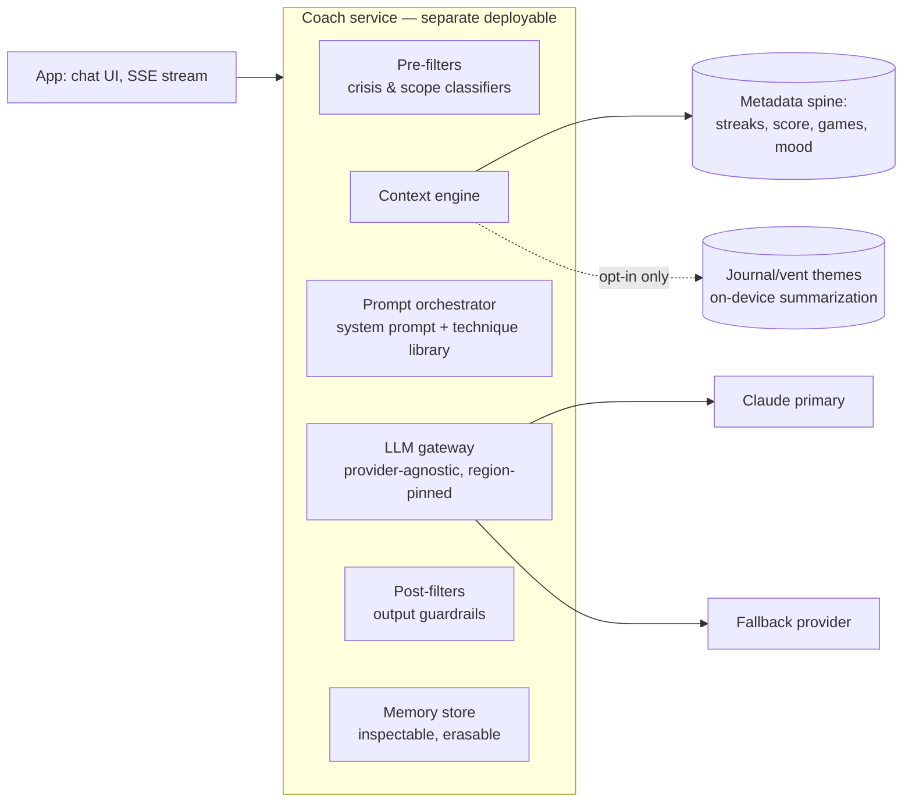

# 07 — AI Coach Plan (AC-1…AC-7, §6.5)

**Positioning rule (from PRD):** the Coach is a coach, never a clinician. Its moat is **cross-studio context**, not the chatbot. Safety certification is a launch gate equal to functional QA.

## 1. Architecture

- **Provider-agnostic gateway** (PRD open Q9): model, region, and price per conversation are config; per-user token budgets implement the free-tier cap; response caching for templated moments (workout explanations).
- **Coach service is the first extracted service** — different scaling profile, cost controls, and safety review cadence than the core API.

## 2. Context engine (AC-2) — the privacy-critical part

| Source | Access | Mechanism |
|---|---|---|
| Streaks, Mind Score components, focus results, self-reported mood trend | **Default on** | Read from metadata spine; serialized into a compact context block per conversation |
| Journal & vent *themes* | **Per-feature opt-in, off by default, revocable** | Content never leaves the E2EE boundary raw: summarization/theme-extraction runs **on-device** (small local model or structured self-tagging); only the resulting theme labels (from a fixed taxonomy — e.g. `work-stress`, `sleep`, `relationships`) are sent, and they are marked as opt-in-derived so revocation can purge them from memory |
| Coach conversation memory | Default on, user-inspectable | See §5 |

Never used for model training (contractual zero-retention with providers + our own no-training rule). Opt-in state changes are recorded in the consent ledger; revocation triggers purge of derived memory items.

## 3. Capabilities by release

| Release | Capability |
|---|---|
| v1.0 (AC-1) | Designs & explains the daily Mind Workout; motivational check-ins; session debriefs. CBT-informed reframing + motivational-interviewing style, from a **clinically reviewed technique library** (versioned CMS collection; each technique has approved framing + examples) |
| v1.0 (AC-7) | "What my Coach knows" — memory list with per-item delete + wipe-all |
| P2 (AC-5) | Voice conversations, < 1.5s to first token (streaming STT → LLM token stream → incremental TTS; budget: STT 300ms + first token 700ms + TTS start 400ms) |
| P2 (AC-6) | Proactive insights ("focus scores are higher in weeks you vent") — generated from metadata patterns, framed as observations never diagnoses; **each insight type is a template reviewed by clinical advisors** before it can fire |

## 4. Guardrails (AC-3, §6.5) — defense in depth

1. **System prompt & scope:** self-describes as a coach; reminds users when conversation approaches clinical territory; no diagnosis, medication, treatment, or crisis counseling; warm refusal/handoff copy (never clinical/robotic) from the reviewed copy library.
2. **Pre-filter (input):** lightweight crisis/self-harm/violence classifier on every user message *before* the LLM. On trigger → deterministic escalation path (no LLM improvisation): supportive acknowledgment template + **native crisis sheet** with regional directory + (Phase 3) listener handoff offer. The sheet is rendered by the app, not just text — it works even if generation fails.
3. **In-model:** technique library + few-shot exemplars; hard instruction hierarchy; jailbreak-resistant prompt structure.
4. **Post-filter (output):** classifier + rule checks on every response (medical advice patterns, diagnosis language, banned terms — "therapy/therapist/psychologist" for self-description); violation → regenerate once with stricter constraints → fall back to safe template.
5. **Rate/cost:** per-user budgets (free-tier daily check-in cap is an entitlement rule), abuse throttles.
6. **Logging:** conversations are E2E-encrypted at rest under the user's keys (doc 06); a separate consented+anonymized failure-case sample stream (opt-in, clearly explained) feeds the quarterly clinical review — the only path where any conversation content is reviewable, per §6.5.

## 5. Memory (AC-7)

- Memory items are discrete, human-readable facts ("prefers evening sessions", "training for a marathon"), each with source + timestamp, stored encrypted.
- Extraction runs per-session with a constrained schema; items derived from opt-in journal/vent themes are tagged and purged on revocation.
- UI: full list, per-item delete, wipe-all; deletions propagate to any cached context immediately.

## 6. Safety evaluation gate (AC-4) — release process

- **Red-team suite** (versioned in-repo, run in CI against the full stack — prompts + filters + model, not the model alone):
  - crisis scenarios (direct, indirect, escalating, third-party)
  - medical/medication/diagnosis questions
  - jailbreaks & role-play coercion ("pretend you're my therapist")
  - self-harm-adjacent and eating/body-image-adjacent prompts
  - boundary probes (minors, abuse disclosures, violence)
- Harness: promptfoo (or in-house) with graded assertions: **must-escalate** cases (crisis sheet shown), **must-refuse-warmly** cases (tone-scored), **must-not-say** patterns; human review of graded transcripts for the release sign-off.
- **Gate:** suite passes per language before the Coach ships in that language — no exceptions; results archived per release for audit (§6.5). Model/prompt/filter changes all re-trigger the gate.
- Continuous: canary evals in prod (shadow traffic on templated scenarios), guardrail-trigger dashboards, weekly review of escalation events (counts only, no content).

## 7. Clinical advisory integration

- Advisors review before release: system prompts, technique library, escalation scripts, insight templates (AC-6), refusal copy.
- Quarterly: sample of anonymized, consented failure cases; crisis-flow effectiveness; directory accuracy (§6.2).
- Advisory sign-off is a tracked artifact per release (same rigor as the eval archive).

## 8. Cost & model strategy (open Q9 — recommendation)

- Primary: Claude (strong safety behavior, steerability); fallback second provider wired through the gateway from day one (availability + negotiation leverage).
- Tiering: small/fast model for classification filters and templated moments; frontier model for open coaching turns; cache workout-explanation generations.
- Budget target to validate in beta: **< $0.05 per active user per day** at free-tier caps; instrument cost per conversation from the first prototype.
- Region pinning per provider for data-residency alignment.
